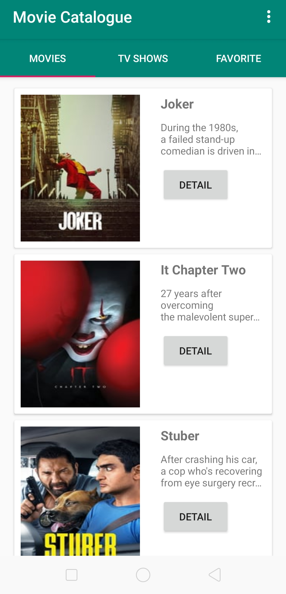
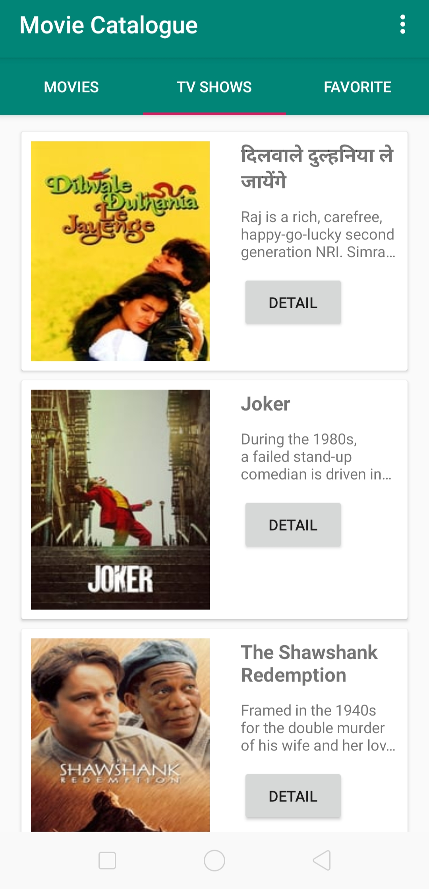
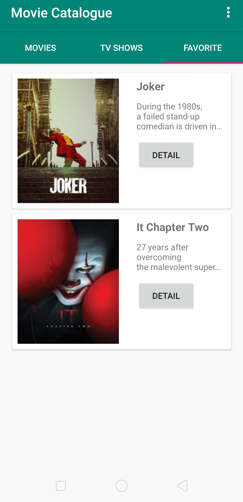

# Menjadi Android Developer Expert
 
### Submission
Anda sudah mempelajari bagaimana konsep penyimpanan lokal pada aplikasi Android. Untuk mempelajari modul selanjutnya, Anda perlu mengirimkan proyek aplikasi dengan tema Movie Catalogue (Local Storage). Movie Catalogue (Local Storage) adalah sebuah aplikasi yang merupakan lanjutan dari submission sebelumnya. Pada proyek ini Anda perlu menerapkan SQLite sebagai media penyimpanan lokal.

### Penampakan
  

### Kriteria
Fitur yang harus ada pada aplikasi:

1. Daftar film
   Syarat:
   - Terdapat 2 (dua) halaman yang menampilkan daftar film (Movies dan Tv Show).
   - Menggunakan Fragment untuk menampung halaman Movies dan Tv Show.
   - Menggunakan RecyclerView untuk menampilkan daftar film.
   - Menggunakan BottomNavigationView, TabLayout, atau yang lainnya sebagai navigasi antara halaman Movies dan Tv Show.
   - Menampilkan indikator loading ketika data sedang dimuat.

2. Detail film
   Syarat:
   - Menampilkan poster dan informasi film pada halaman detail film.
   - Menggunakan ConstraintLayout untuk menyusun layout.
   - Menampilkan indikator loading ketika data sedang dimuat.

3. Favorite Film
   Syarat:
   - Dapat menyimpan film ke database favorite.
   - Dapat menghapus film dari database favorite.
   - Terdapat halaman untuk menampilkan daftar Favorite Movies.
   - Terdapat halaman untuk menampilkan daftar Favorite Tv Show.

4. Localization
   Syarat:
   - Aplikasi harus mendukung bahasa Indonesia dan bahasa Inggris.

5. Configuration Changes
   Syarat:
   - Aplikasi harus bisa menjaga data yang sudah dimuat ketika terjadi pergantian orientasi dari potrait ke landscape atau sebaliknya.

## Note
Bagi teman-teman yang mengambil kelas Menjadi Android Developer Expert di Dicoding, silahkan menggunakan source ini sebagai referensi. Tetapi **TIDAK** untuk di copas seutuhnya tanpa tau fungsinya.

Jika ada kendala, ayo kita diskusikan bersama :) 

> :muscle: Terus belajar dan tetap semangat teman ! Semua kesulitan pasti bisa dilalui ! Code error melatih kita untuk lebih teliti dan lebih memahami !
